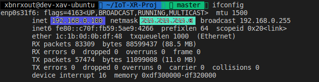
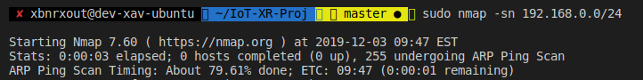
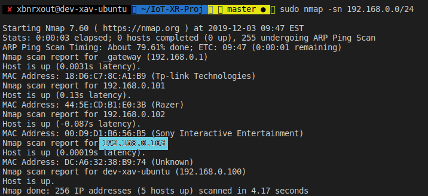
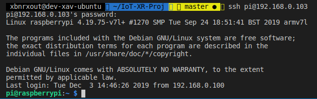
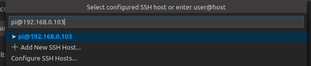
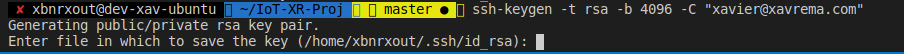

# IoT-XR-Proj

This project will be a comprehensive tutorial as I learn about  
Arduino, Raspbery Pi4, and Wifi-Chips.

>This README will be constantly updated as I progress and learn

## Current Devices  
+  [Arduino]   
+  [Raspberry Pi 4] **(Required)** | 4GB RAM _(2GB min)_ | [64GB] MicroSD _([16GB] --> [32GB] **recomended**)_  
   +  [CanaKit] with air cooling fan  
+  [NodeMCU] 1.0 ESP 12E Module

## Required Tools
+ PC with [OpenSSH Client] **Windows**  
  + Linux/MAC have a builtin Tool
+ [VSCode] with [Remote Development] Enabled
# Project 1
> Create node server with endpoints for requests from devices

## Step 1 - Get Raspian Image
---
Download [Raspian Buster Lite]

---

## Step 2 _(optional)_ Unzip image
---
Unzip the image
- [7-Zip] | Windows
- [Unzip] | Linux\Mac
---
## Step 3 - Create Raspbian Bootable 
---
The simplest method I found, that had the same desired  
outcome as manual tools was [balenaEtcher]  

Simply navigate to the .zip or the .img Raspbian file and   
select the MicroSD you wish to create as a bootable

---
## Step 4 - Create SSH file
---

Navigate into the `/boot` directory on the MicroSD  
and create a `ssh` file 

---

## Step 5 - Test your setup
---

+ Connect the Power to your Pi
+ Connect the LAN cable from your Pi to your home router
  + This should be the same router your PC is connected to

Your Pi green LED should blink for at least 5 second  
## **Do not worry if you green LED stops blinking!**  

As long as your red LED is solid after this, it mean we are good to go

---
## Step 6 - Connecting to your Pi via SSH
---

This is operating system specific

### Windows
---
> TODO: I will fill this section in once I have proved a reliable solution

---
### Linux | Mac
---
We need to now find the IP address of the Pi in our network  
First lets query our network for devices

Install [nmap]  

#### Linux

>`sudo apt install nmap`

#### Mac

>`brew install nmap`

Now we need to determine our IP, but more importantly our subnet mask

In terminal type the command   
> `ifconfig`

You should get a similar output:

My CIDR is `/24` based on my Subnet mask of `255.255.255.0`

This shows that my ip range is `192.168.0.0` --> `192.168.0.255`

Our Pi must have an IP in that range

Now we need to scan our network to find devices

In terminal type in 
> `sudo nmap -sn 192.168.0.0/24`   

This will not work without a CIDR value added in

The command does not tell you what is happening  
So if you press the `up` arrow key it will show 
you the scanning progress as shown below

We should get a table of ARP requests with a device with hostname  
of `Unknown` or `RaspberryPi` with an IP associated.

We can now go ahead and SSH into our Pi

The default username is 
> `pi`

with a default password of  

> `'raspberry'`

In terminal type   
> `ssh pi@`_`IP_ADDRESS`_

On my PC I type in   
>  `ssh pi@192.168.0.103`

A prompt will display and simply type in the default password

You might be prompted to change your password. Do so now

## You have now successfully logged into your pi!

---
## Step 7 - Install Nodejs and NPM
---

I like to install the LTS(Long Term Support) version as they are less   prone to bugs and latest release

On the pi type in   
> `sudo apt-get install curl`   

then   
> `curl -sL https://deb.nodesource.com/setup_12.x | sudo -E bash -`  

Change the `setup_12.x` to the desired version you required  
> e.g.  `setup_13.x` for version 13  
> or `setup_14.x` for version 14

then `sudo apt-get install nodejs`

This will install the PPA desired version of Nodejs

check the node version  
>`node -v`  
> `v12.13.1`  

check the npm version 
> `npm -v`  
> `6.12.1`

---
## Step 8 - Create Directory for project
---

Still in the SSH connection  
type the command 
> `mkdir node-app`

This creates and empty directory for your node app

---
## Step 9 - Create an SSH remote session in VSCode
---

type 
> `exit`  

to stop and logout of the Pi

Open VSCode and press
> `F1`  

to open the Command Palette.  
Search for and Select
> `'Remote-SSH: Connect to Host...'`

Enter your ssh connection string
> `pi@_IP_ADDRESS_`

You will be prompted for a password, so the password you have set on the pi  
is what you enter here

---

## Windows
---
> TODO: I will fill this section in once I have proved a reliable solution

---

## Linux/Mac
---

You can now edit and configure your server from here.

Select `terminal` from the top menu and then select `New Terminal`

Open `File Explorer`  from the side menu

Select `Open Folder` and select from the dropdown menu that pops up our  
`node-app` directory and press `OK`

Re-enter your password

We can now manage our node-app from here without having to using Vi/Vim  
and this gives us a familiar interface to create and edit our app

---
## Step 10 - Add Git and SSH key for Github
---

Within the terminal on VSCode let's install git  
type in 
> `sudo apt install git`

We should now create an ssh key for secure connection to github   
_(Also so we dont have to enter a username and password everytime)_

type in   
> `ssh-keygen -t rsa -b 4096 -C ` _`YOUR_EMAIL_ADDRESS_ON_GITHUB"`_

Press `enter` unless you wish to change the directory the files are generated in

You can default on the next few options by pressing `enter`

---

[Raspian Buster Lite]:https://www.raspberrypi.org/downloads/raspbian/
[7-Zip]:https://www.7-zip.org/
[Unzip]:https://linux.die.net/man/1/unzip
[CanaKit]:https://www.amazon.ca/CanaKit-Raspberry-Starter-Kit-4GB/dp/B07WRMR2CX/ref=sr_1_3?crid=2ULBWDTDYM2LN&keywords=canakit+raspberry+pi+4+starter+kit&qid=1575380504&sprefix=canakit+%2Caps%2C206&sr=8-3
[NodeMCU]:https://www.amazon.ca/J-DEAL%C2%AE-NodeMCU-Internet-ESP8266-Development/dp/B01F5ALLFM/ref=sr_1_4?keywords=nodemcu&qid=1575380554&sr=8-4
[Arduino]:https://store.arduino.cc/usa/arduino-uno-rev3
[Raspberry Pi 4]:https://www.amazon.ca/Raspberry-Pi-Computer-Model-4GB/dp/B07W4JM192/ref=sr_1_4?keywords=Raspberry+Pi+4&qid=1575380617&sr=8-4
[32GB]:https://www.amazon.ca/Sandisk-SDSQUAR-032G-GN6MA-Ultra-Micro-Adapter/dp/B073JWXGNT/ref=sr_1_3?crid=1NDQVWZX4F5F3&keywords=32+micro+sd+card&qid=1575380658&sprefix=32+micr%2Caps%2C185&sr=8-3
[16GB]:https://www.amazon.ca/Sandisk-Ultra-Micro-UHS-I-Adapter/dp/B073K14CVB/ref=sr_1_3?keywords=16+micro+sd+card&qid=1575380697&sr=8-3
[64GB]:https://www.amazon.ca/Sandisk-SDSQXA2-064G-GN6MA-Extreme-microSD-Adapter/dp/B07FCMBLV6/ref=sr_1_3?keywords=64+micro+sd+card&qid=1575380736&smid=A3DWYIK6Y9EEQB&sr=8-3
[OpenSSH Client]:https://docs.microsoft.com/en-gb/windows-server/administration/openssh/openssh_install_firstuse
[balenaEtcher]:https://www.balena.io/etcher/
[Remote Development]:https://code.visualstudio.com/docs/remote/ssh
[VSCode]:https://code.visualstudio.com/
[nmap]:https://nmap.org/
